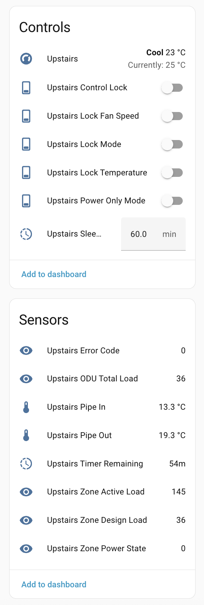

# esphome-lgap

_**NOTE:** This integration works with LG Outdoor Units (ODUs/inverters). If your ODU doesn't have an LGAP/Central Control interface or integration through a board such as the LG PI-485 board, or you're looking to integrate with the indoor wall panel controller instead, check out: [JanM321/esphome-lg-controller](https://github.com/JanM321/esphome-lg-controller)._


**esphome-lgap** is an implementation of the LG Aircon Protocol (LGAP) implemented as an [esphome](https://esphome.io/) component. This enables you to use an ESP8266/ESP32 to interface directly on the interface generally used for building management system integration/control of LG HVAC units. 

One of the best benefits of using this integration is you can use a single LGAP interface on your outdoor unit (ODU) to drive multiple different indoor unit (IDU) zones.





## Recent Updates (November 2025)

### Temperature & Sensors
- ✨ **Fixed temperature calculation** - Corrected current temperature formula to `(192 - raw) / 3` for accurate readings
- ✨ **Immediate temperature updates** - Temperatures now appear immediately in Home Assistant on startup (rate-limited thereafter)
- ✨ **Pipe temperature sensors** - Auto-generated sensors for refrigerant inlet and outlet temperatures
- ✨ **Temperature limits enforcement** - Heat mode: 16-30°C, other modes: 18-30°C (per LG spec)
- ✨ **Error code sensor** - Exposes LG service error codes (0 = OK)

### Load Monitoring (LonWorks Compatible)
- ✨ **Zone Active Load** - Real-time dynamic load per zone (`nvoLoadEstimate`)
- ✨ **Zone Power State** - ON/OFF state flag (`nvoOnOff`)
- ✨ **Zone Design Load** - Fixed capacity/duct size index (`nciRatedCapacity`)
- ✨ **ODU Total Load** - System-wide compressor load (`nvoThermalLoad`)

### Sleep Timer
- ✨ **Persistent timer duration** - User sets duration once (0-420 minutes), stays saved
- ✨ **Auto-start on power ON** - Timer automatically starts countdown when AC turns ON
- ✨ **Timer remaining sensor** - Real-time countdown display
- ✨ **Auto-shutoff** - AC turns OFF when timer expires, duration stays saved for next use

### Control Locks & Security
- ✨ **Control Lock** - Master child lock (protocol TX4 bit2)
- ✨ **Temperature Lock** - Prevent temperature changes
- ✨ **Fan Speed Lock** - Prevent fan speed changes
- ✨ **Mode Lock** - Prevent mode changes
- ✨ **Power Only Mode** - Allow only ON/OFF, lock all other controls
- ✨ **Wall controller enforcement** - Automatically reverts unauthorized changes made at physical wall controller when locks are active

### Optional Features (Opt-In)
- ✨ **Plasma ion control** - Air purification switch (protocol TX4 bit4) - `supports_plasma: true`
- ✨ **Auto swing mode** - Auto airflow for ducted units - `supports_auto_swing: true`
- ✨ **Auto fan speed** - Auto fan mode - `supports_auto_fan: true`
- ✨ **Quiet fan mode** - Silent operation - `supports_quiet_fan: true`
- ✨ **Turbo fan mode** - Maximum power - `supports_turbo_fan: true`

### Quality of Life
- ✨ **Reduced log verbosity** - Moved frequent messages to VERBOSE level for cleaner logs
- ✨ **Race condition fix** - Fixed temperature change race condition with `write_update_pending` flag
- ✨ **Clean UI by default** - All advanced features disabled by default, opt-in per zone
- ✨ **Auto-generated entities** - All sensors, numbers, and switches auto-created with smart naming

### ⚠️ Configuration Requirements
If upgrading from an older version, ensure your YAML includes these base components (required for auto-generated entities):
```yaml
sensor:
number:
switch:
button:
```

## Features

- ✅ **Full Climate Control** - Native Home Assistant climate entity with standard controls
- ✅ **Multi-Zone Support** - Control multiple zones from single ODU interface
- ✅ **Advanced Sensors** - Pipe temperatures, load monitoring, error codes
- ✅ **LonWorks Integration** - Compatible with LG's commercial BMS protocol fields
- ✅ **Control Locks** - Child lock, temperature lock, fan lock, mode lock, power-only mode
- ✅ **Sleep Timer** - Automatic shutoff timer (0-420 minutes)
- ✅ **Wall Controller Enforcement** - Reverts unauthorized changes made at physical controller when locks active
- ✅ **Optional Features** - Plasma ion, auto swing, quiet/turbo fan modes (opt-in per zone)
- ✅ **Temperature Accuracy** - Corrected LG protocol formulas for accurate readings
- ✅ **Smart Updates** - Configurable temperature update intervals, immediate first reading

## Table of Contents

* [Project background](./background.md)
* [LGAP protocol detail](./protocol.md)
* Build instructions (below)


## Build intructions

### Disclaimer
This whole exercise has been for my own personal learning and experimentation. There are aspects of integrating with high voltage equipment and looking into unpublished protocols. Attempting anything detailed here is at your own risk, may void the warranty of your unit or worse may result in physical harm.

I've tried to build this using the standard esphome [external component](https://esphome.io/components/external_components.html?highlight=external) method and make it as simple as possible to reference in your esphome configuration.

### 1. Device selection

I've tried a couple of ESP32-based devices with varying success. Below is a list of known tested devices.

|Model Number|Price|Link|Test result|
|------|------|----|---|
|M5Stack Atom Lite + ATOMIC RS485 Base|$7.50 USD +<br/>$9.95 USD|https://shop.m5stack.com/products/atom-lite-esp32-development-kit<br/>https://shop.m5stack.com/products/atomic-rs485-base|**Recommended**|
|Lilygo T-RSC3|$17.98 USD|https://www.lilygo.cc/products/t-rsc3|Onboard RS485 interface **not compatible**|

### 2. Wiring

**Refer to the disclaimer above.**

On my ODU there are 4 internal pins right next to each other that specify 12V, GND, Central Control A & B. The great thing about the [ATOMIC RS485 Base](https://shop.m5stack.com/products/atomic-rs485-base) is that you can give it 12V and it will also power the ESP32. That makes the wiring really simple. I wire up each of those pins from the ODU to the pins on the RS485 interface and we're good to go.


You can also in theory wire this same configuration to an older generation LG ODU that has compatibility with the PI-485 expansion board. The PI-485 board adds an LGAP interface to an ODU. As of right now this project hasn't been tested with the PI-485, but all the documentation points to this working. If you test it and it works, let me know!

### 3. Esphome manifest

I am making the assumption that you're also using the M5Stack devices as listed above, here is some sample yaml you can add to an existing yaml config:

```yaml
external_components:
  - source:
      type: git
      url: https://github.com/jourdant/esphome-lgap
      ref: main
    components: [ "lgap"]
    refresh: 0sec

lgap:
  - id: lgap1
    uart_id: lgap_uart1

climate:
  - platform: lgap
    id: lgap_zone_1
    name: 'Zone 1 - Ground Floor'
    lgap_id: lgap1
    zone: 0

  - platform: lgap
    id: lgap_zone_2
    name: 'Zone 2 - Front Office'
    lgap_id: lgap1
    zone: 1
```

If you want to add extra zones, you can reference the same ```lgap_id``` on the climate component. It is also possible to have multiple LGAP protocol components using different UART components in the same configuration.

## Advanced Features

The LGAP component supports many advanced features that can be optionally enabled per zone. All features are **disabled by default** for a clean, minimal interface.

### Available Configuration Options

```yaml
climate:
  - platform: lgap
    id: lgap_zone_cinema
    name: 'Cinema Room'
    lgap_id: lgap1
    zone: 2
    
    # Optional: Temperature update rate (default: 300000ms / 5 minutes)
    temperature_publish_time: 300000ms
    
    # Optional: Enable auto airflow mode for ducted units (default: false)
    # Shows "Swing Set: Off or Vertical" in Home Assistant
    supports_auto_swing: true
    
    # Optional: Enable auto fan speed mode (default: false)
    # Adds "Auto" to fan speed options alongside Low/Medium/High
    supports_auto_fan: true
    
    # Optional: Enable quiet/slow fan mode (default: false)
    # Adds "Quiet" fan speed option for silent operation
    supports_quiet_fan: true
    
    # Optional: Enable turbo/power fan mode (default: false)
    # Adds "Focus" fan speed option for maximum cooling/heating
    supports_turbo_fan: true
    
    # Optional: Enable plasma ion air purification control (default: false)
    # Creates a switch entity to control plasma ion feature
    supports_plasma: true
```

### Auto-Generated Sensors

The component automatically creates the following sensors for each zone:

- **Pipe In Temperature** - Refrigerant pipe inlet temperature (°C)
- **Pipe Out Temperature** - Refrigerant pipe outlet temperature (°C)
- **Error Code** - Service error codes (0 = OK)
- **Zone Active Load** - Real-time dynamic load index (LonWorks `nvoLoadEstimate`)
- **Zone Power State** - Zone on/off state flag (LonWorks `nvoOnOff`)
- **Zone Design Load** - Fixed design capacity index (LonWorks `nciRatedCapacity`)
- **ODU Total Load** - Total outdoor unit load across all zones (LonWorks `nvoThermalLoad`)

### Auto-Generated Controls

Each zone automatically includes:

- **Sleep Timer** - Number input (0-420 minutes, 0 disables timer)
- **Timer Remaining** - Countdown sensor showing minutes until auto-shutoff
- **Control Lock** - Master lock switch (child lock)
- **Lock Temperature** - Prevent temperature changes
- **Lock Fan Speed** - Prevent fan speed changes
- **Lock Mode** - Prevent mode changes
- **Power Only Mode** - Allow only ON/OFF, lock all other controls
- **Plasma** - Control plasma ion air purification (only if `supports_plasma: true`)

### Lock Enforcement

All lock switches enforce restrictions both from Home Assistant **and** from physical wall controller changes. If a user attempts to change a locked parameter at the wall controller, the system will automatically revert the change.

### Temperature Limits

The component enforces LG protocol temperature limits:
- **Heat mode**: 16-30°C
- **All other modes** (Cool/Dry/Fan/Auto): 18-30°C

### Example: Full-Featured Configuration

```yaml
climate:
  - platform: lgap
    id: bedroom
    name: 'Master Bedroom'
    lgap_id: lgap1
    zone: 3
    supports_quiet_fan: true      # Enable quiet mode for night
    supports_plasma: true         # Enable air purification
    
  - platform: lgap
    id: living_room
    name: 'Living Room'
    lgap_id: lgap1
    zone: 4
    supports_auto_swing: true     # Ducted unit with auto airflow
    supports_auto_fan: true       # Enable auto fan speed
    supports_turbo_fan: true      # Enable power cooling/heating
    supports_plasma: true         # Enable air purification
```

### Example: Minimal Configuration

```yaml
climate:
  - platform: lgap
    id: office
    name: 'Home Office'
    lgap_id: lgap1
    zone: 5
    # Uses defaults: Low/Medium/High fan only, no swing, no plasma
    # Still gets all sensors and lock controls automatically
```

## Troubleshooting

### Temperatures not appearing immediately in Home Assistant

The component implements rate-limiting for temperature updates (default: 5 minutes) to reduce protocol overhead. However, the first reading is always published immediately. If temperatures aren't appearing:

1. Check ESPHome logs for "Processing climate message" entries
2. Verify zone number matches your LG indoor unit configuration
3. Adjust `temperature_publish_time` if you need more frequent updates

### Lock switches not preventing changes

Lock enforcement works in two stages:
1. **Home Assistant requests** are blocked immediately with a warning log
2. **Wall controller changes** are detected and reverted automatically

Check ESPHome logs for messages like "Temperature change blocked - temperature lock is active" or "Mode changed at wall controller while lock active - reverting".

### Fan modes not appearing

Fan modes are now opt-in:
- **Default**: Low, Medium, High only
- **Auto**: Requires `supports_auto_fan: true`
- **Quiet**: Requires `supports_quiet_fan: true`
- **Turbo/Focus**: Requires `supports_turbo_fan: true`

This ensures a clean UI for units that don't support advanced fan modes.

### Swing control not appearing

Swing control is disabled by default. For ducted units with auto airflow capability, add:
```yaml
supports_auto_swing: true
```

This will add "Off" and "Vertical" swing options to Home Assistant.

### Error code sensor showing non-zero value

Error codes are LG service codes. Common meanings:
- `0` = No error (normal operation)
- Non-zero values indicate service alerts or error conditions

Refer to your LG service manual for specific error code meanings, or check the ODU display panel.
